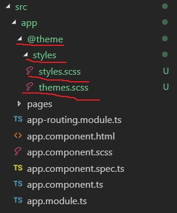

### 安裝ngx-admin

#### 全新安裝

參考官網[ngx-admin](https://akveo.github.io/ngx-admin/)

下載sourcecode

```
git clone https://github.com/akveo/ngx-admin.git
```

下載完後

```
cd ngx-admin && npm i
```

安裝完後

```
npm start
```

打開瀏覽器輸入http://localhost:4200

#### 現有專案

建立新的專案

```
ng new SampleUILayout
cd SampleUILayout
```

安裝模組

```
npm install --save @nebular/theme @angular/cdk @angular/animations
npm install --save @nebular/auth @nebular/security
npm install --save nebular-icons
```

設定nebular的模組在`src\app\app.module.ts`下

```typescript
import { BrowserModule } from '@angular/platform-browser';
import { NgModule } from '@angular/core';


import { AppRoutingModule } from './app-routing.module';
import { AppComponent } from './app.component';
import { NbThemeModule } from '@nebular/theme';
@NgModule({
  declarations: [
    AppComponent
  ],
  imports: [
    BrowserModule,
    AppRoutingModule,
    // this will enable the default theme, you can change this by passing `{ name: 'cosmic' }` to enable the dark theme
    NbThemeModule.forRoot(),
  ],
  providers: [],
  bootstrap: [AppComponent]
})
export class AppModule { }

```

加入Styles

加入預設的style在`angular.json`裏

```
"styles": [
  "./node_modules/@nebular/theme/styles/prebuilt/default.scss", // or cosmic.scss
],
```

##### 建立Pages模板

```
ng g m pages --routing
```

在**PagesModule**下建立各元件

```
ng g c pages\pages --flat

```

先將路由連接起來

將**PagesModule**加入到`src\app\app.module.ts中

```typescript
import { BrowserModule } from '@angular/platform-browser';
import { NgModule } from '@angular/core';


import { AppRoutingModule } from './app-routing.module';
import { AppComponent } from './app.component';
import { NbThemeModule } from '@nebular/theme';
import { PagesModule } from './pages/pages.module';
@NgModule({
  declarations: [
    AppComponent
  ],
  imports: [
    BrowserModule,
    AppRoutingModule,
    // this will enable the default theme, you can change this by passing `{ name: 'cosmic' }` to enable the dark theme
    NbThemeModule.forRoot(),
    PagesModule, // PagesModule
  ],
  providers: [],
  bootstrap: [AppComponent]
})
export class AppModule { }
```

分別修改`src\app\app-routing.module.ts`和`src\app\pages\pages-routing.module.ts`

```typescript
import { NgModule } from '@angular/core';
import { Routes, RouterModule } from '@angular/router';
const routes: Routes = [
  { path: '', redirectTo: 'pages', pathMatch: 'full' },
  { path: '**', redirectTo: 'pages' },
];
@NgModule({
  imports: [RouterModule.forRoot(routes)],
  exports: [RouterModule]
})
export class AppRoutingModule { }

```

```typescript
import { NgModule } from '@angular/core';
import { Routes, RouterModule } from '@angular/router';
import { PagesComponent } from './pages.component';
const routes: Routes = [
  { path: 'pages', component: PagesComponent }
];
@NgModule({
  imports: [RouterModule.forChild(routes)],
  exports: [RouterModule]
})
export class PagesRoutingModule { }
```

將**NbSidebarModule**, **NbLayoutModule**, **NbSidebarService**加到**PagesModule**

```typescript
import { NgModule } from '@angular/core';
import { CommonModule } from '@angular/common';
import { NbSidebarModule, NbLayoutModule, NbSidebarService } from '@nebular/theme';
import { PagesRoutingModule } from './pages-routing.module';
import { PagesComponent } from './pages.component';
@NgModule({
  declarations: [PagesComponent],
  imports: [
    CommonModule,
    PagesRoutingModule, 
    NbLayoutModule,     //
    NbSidebarModule,    //
  ],
  providers:[NbSidebarService]
})
export class PagesModule { }

```

在`src\app\pages\pages.component.html`加入Nb元件

```html
<nb-layout>
  <nb-layout-header fixed>Company Name</nb-layout-header>

  <nb-sidebar>Sidebar Content</nb-sidebar>

  <nb-layout-column>Page Content</nb-layout-column>
</nb-layout>
```

##### 主題系統

先將原來在`src\styles.scss`刪除，在`app`下建立一個資料夾`@theme`和在`@theme`下建立資料夾`styles`在下面建立`themes.scss`的檔案



```scss
// @nebular theming framework
@import '~@nebular/theme/styles/theming';
// @nebular out of the box themes
@import '~@nebular/theme/styles/themes';

// and change the variables you need, 
// or simply leave the map empty to use the default values
// let's make it blue-ish instead of the default white color
$nb-themes: nb-register-theme((
  color-bg: #4ca6ff,
  shadow: 0 1px 2px 0 #3780c0,
  layout-bg: #ffffff,
  color-fg: #222222
), default, default); // let's leave it as default

```

在建立一個`styles.scss`檔裏面的內容，將此檔案加入`angular.json`中

```scss
// themes - our custom or/and out of the box themes
@import 'themes';

// framework component themes (styles tied to theme variables)
@import '~@nebular/theme/styles/globals';
// @import '~@nebular/auth/styles/all';
// @import '~@nebular/bootstrap/styles/globals';
// ...

// install the framework and custom global styles
@include nb-install() {

  // framework global styles
  @include nb-theme-global();
 
};

```

```json
"styles": [
              "node_modules/bootstrap/dist/css/bootstrap.css",
              "node_modules/@nebular/theme/styles/prebuilt/default.scss", // or cosmic.scss
              "node_modules/@nebular/bootstrap/styles/prebuilt/cosmic.scss",
              "node_modules/@nebular/bootstrap/styles/prebuilt/corporate.scss",
              "src/app/@theme/styles/styles.scss"
            ],
```


加入bootstrap

```
npm i @nebular/bootstrap bootstrap
```

將bootstrap加入到`angular.json`中


```json
"styles": [
              "node_modules/bootstrap/dist/css/bootstrap.css",
              "node_modules/@nebular/theme/styles/prebuilt/default.scss", // or cosmic.scss
              "node_modules/@nebular/bootstrap/styles/prebuilt/cosmic.scss",
              "node_modules/@nebular/bootstrap/styles/prebuilt/corporate.scss",
              "src/app/@theme/styles/styles.scss"
            ]
```

### 加入menuitem

先要加入**NbMenuModule**和**BrowserAnimationsModule**到`src\app\app.module.ts`中

```typescript
//...
import { BrowserAnimationsModule } from '@angular/platform-browser/animations';
import { NgModule } from '@angular/core';
//...
import { NbThemeModule,NbMenuModule } from '@nebular/theme';

@NgModule({
  declarations: [
    AppComponent
  ],
  imports: [
    // ...
    BrowserAnimationsModule,
    // ...
    NbMenuModule.forRoot(),
  ],
  providers: [],
  bootstrap: [AppComponent]
})
export class AppModule { }

```

在pages的資料夾下建立`pages-menu.ts`加入要顯示的menu item

```typescript
import { NbMenuItem } from '@nebular/theme';

export const MENU_ITEMS: NbMenuItem[]=[
    {
        title:'E-commerce',
        icon:'nb-e-commerce',
        link:'#',
        home:true,
    },
    {
        title:'Miscellaneous',
        icon:'nb-shuffle',
        children: [
            {
                title: '404',
                link: '#'
            }
        ]
    }
];
```

在**PagesModule**中加入使用menu的模組

```typescript
import { NgModule } from '@angular/core';
import { CommonModule } from '@angular/common';

import { NbSidebarModule, NbLayoutModule, NbSidebarService,NbMenuModule } from '@nebular/theme';

import { PagesRoutingModule } from './pages-routing.module';
import { PagesComponent } from './pages.component';

@NgModule({
  declarations: [PagesComponent],
  imports: [
    CommonModule,
    PagesRoutingModule,
    NbLayoutModule,
    NbSidebarModule,
    NbMenuModule, // menu 模組
  ],
  providers:[NbSidebarService]
})
export class PagesModule { }

```

在`src\app\pages\pages.component.ts`中加入MENU_ITEMS

```typescript
import { Component, OnInit } from '@angular/core';
import { MENU_ITEMS } from './pages-menu'; //加入

@Component({
  selector: 'app-pages',
  templateUrl: './pages.component.html',
  styleUrls: ['./pages.component.scss']
})
export class PagesComponent implements OnInit {
  menu= MENU_ITEMS; // 指定
  constructor() { }
 
  ngOnInit() {
  }

}

```

在html檔`src\app\pages\pages.component.html`設定` <nb-sidebar><nb-menu [items]="menu" ></nb-menu></nb-sidebar>`

```html
<nb-layout>
  <nb-layout-header fixed>Company Name</nb-layout-header>

  <nb-sidebar><nb-menu [items]="menu" ></nb-menu></nb-sidebar>

  <nb-layout-column>Page Content</nb-layout-column>
</nb-layout>
```

加入miscellaneous

```
ng g m pages\miscellaneous --routing
ng g c pages\miscellaneous\miscellaneous --flat
ng g c pages\miscellaneous\NotFound

```

