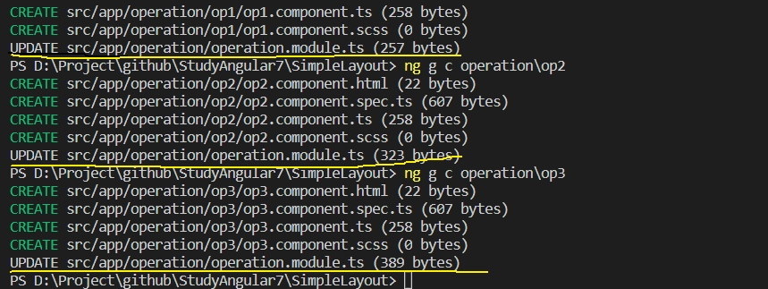
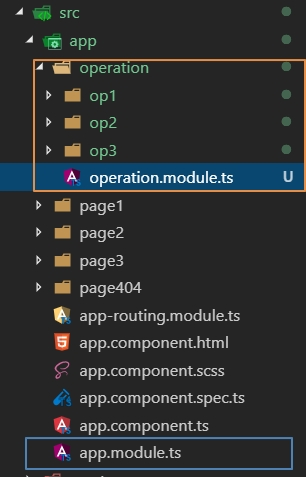
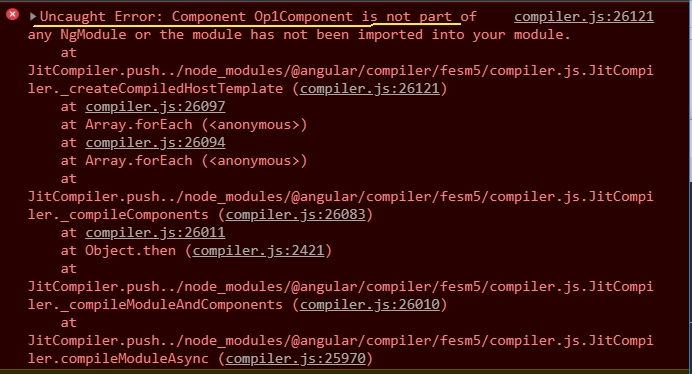
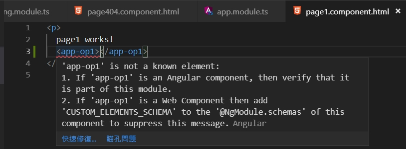
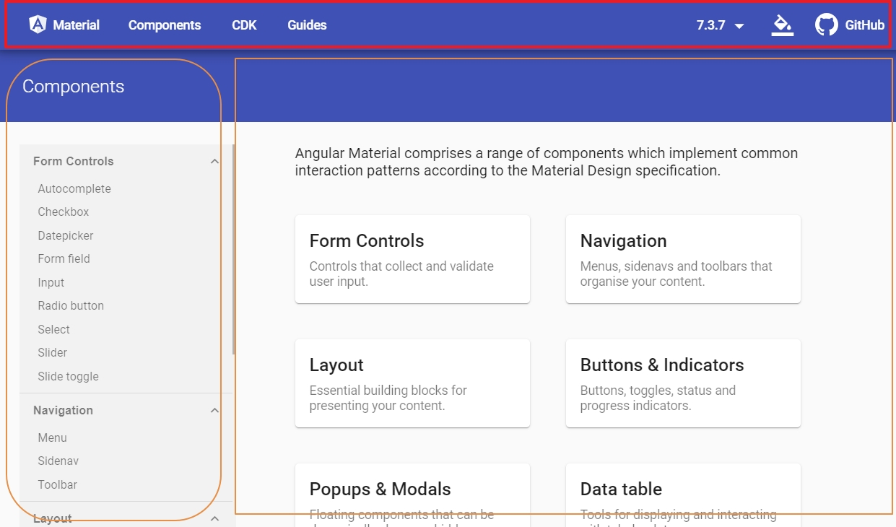
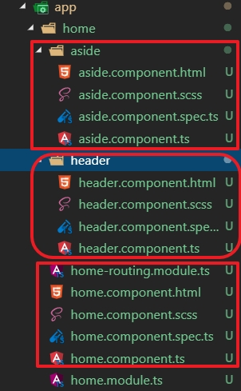

### SimpleLayout

先建立簡單的layout,來測式路由和組件的關系

#### 建立專案

```
ng new SimpleLayout
```

選擇有路由和SCSS

產生3個頁面

```
ng g c page1
ng g c page2
pg g c page3
```

#### 加入路由

在`app-routing.module.ts`的檔案中加入3個由規則分別對應到Page1Component,Page2Component,Page3Component

- path: 設定導覽的相對路徑
- component: 設定要載入的Component

```typescript
const routes: Routes = [
  {path:'',children:[]},
  {path:'p1',component:Page1Component},
  {path:'p2',component:Page2Component},
  {path:'p3',component:Page3Component}
];
```

當導覽路徑變化時，Angular Router會將導覽路徑拿來跟路由規則逐一比對，如果路徑與`path`條件符合就會執行該路由條件，因為目前我們設定了`compent`屬性，所符合條件就會將`component`屬性所指定的Component插入目前Componet的`router-outlet`tag內

#### 萬用路由(**)

Angular Router提供一個萬用路由規則，當`path`屬性設定為`**`時表示條修為任意值，路由比對到這一個規則時一定會符合，所以設置在此規則後面的路由規則基本上是無效的，因為任何導覽路徑到了萬用路由就會被攔載到，所以正常會將**萬用路由放置在路由規則的最後面**

#### 練習加入萬用路由

嘗式加入一固萬用路由，並改用`redirectTo`屬性，將其設定為`p1`

- redirectTo: 表示當路由規則符合時會重新導覽到**reditectTo**所指定的路由路徑

```typescript
  const routes: Routes = [
    {path:'',children:[]},
    {path:'p1',component:Page1Component},
    {path:'p2',component:Page2Component},
    {path:'p3',component:Page3Component},
    {path:'**',redirectTo:''}
  ];
```

一般而言萬用路由不應該被執行到，因為這表示目前導覽路行是非預期的路籼，所以萬用路由會比較像是為了避免系統出錯的預防機制，比較常則的情境是

- 導覽到首頁：此種情境適合在發生錯誤時使用者可以括棄目前資訊，大部分來說這種非預期狀況是一般使用者無法排除的，因此導引至首面可以讓使用者繼續操作， 在PWA(Progressive Web App)網路應該是不錯的選擇

- Page Not Fount：目前網路比較普遍的作法，是建立一個HTTP 404頁面，對於此較需要立即𤗤正的網站會比較適合，除了可以藉由404頁面蒐集當時狀態讓後續可以分析了解原因，這種中斷式頁面也較容易讓使用者立即反應回饋䌞維護人員。

#### 練習製作HTTP 404頁面

 透過指令`ng g c page404`建立對修改page404.html

```html
<p>
  404 Page Not Found
</p>
```

修改`app-routing.module.ts`將萬用路由指向Page404Component

```typescript
const routes: Routes = [
  {path:'',children:[]},
  {path:'p1',component:Page1Component},
  {path:'p2',component:Page2Component},
  {path:'p3',component:Page3Component},
  //{path:'**',redirectTo:''}
  {path:'**',component:Page404Component}
];
```

### 導航(Navigation)

我們透過改變導覽路徑來切換內容，但是一般使用者不會透過修改網址來切換功能，正常情況下應該透過點選操作來𠝽換內容

#### RouterLink

Angulr 提供一個很便利的功能RouterLink，讓我們不需要撰寫程式碼可以直接在樣板內直接設定連結對象

#### 練習加入RouterLink

修改`app.compoenet.html`分別入超連結`a`, 按鈕`button`標籤`span`，並分別設定`routerLink`屬性對應到路由規則的`p1`,`p2`,`p3`。

> routerLink屬性加入`/`來表示相對路徑

 ```html
<a routerLink="/p1" >Page1</a>
<button routerLink="/p2" >Page2</button>
<span routerLink="/p3" >Page3</span>
<hr/>
<router-outlet></router-outlet>
 ```

### 模組(NgModule)

過去我們將所有實作的元件(Compenent)都塞到**AppModule**內，但是實務上的專案可能會有幾十個甚至上百個元件，如果全部都放置在**AppModule**內，會造成專案𩁤以維護也𩁤以分工的問題，所有比較合理的做法就是將元件分拆到不同的模組(NgModule),再將模組聚合起來。

開啟`src\app\app.module.ts`可以看到目前所建立的元件

```typescript
import { BrowserModule } from '@angular/platform-browser';
import { NgModule } from '@angular/core';

import { AppRoutingModule } from './app-routing.module';
import { AppComponent } from './app.component';
import { Page1Component } from './page1/page1.component';
import { Page2Component } from './page2/page2.component';
import { Page3Component } from './page3/page3.component';
import { Page404Component } from './page404/page404.component';

@NgModule({
  declarations: [
    AppComponent,
    Page1Component,
    Page2Component,
    Page3Component,
    Page404Component
  ],
  imports: [
    BrowserModule,
    AppRoutingModule
  ],
  providers: [],
  bootstrap: [AppComponent]
})
export class AppModule { }

```

我們可以把**模組**假想成**資料夾**，把**元件**想成是**檔案**

#### 建立新模組

透過Angular-CLI指令`ng g m [name]`來建立新模組, 例如建立一個**OperationModule**，透過`ng g m operation`

> `g`為`generate`縮寫，`m`為`module`縮寫

CLI產生一個位於src\app\operation\operation.module.ts的模組

如果某個元件要使用到這個模組就必須將它註冊到該元件所屬的模組內，這樣才能使用。

我們在**OperationModule**模組位罝`(src\app\operation\)`下面再建立3個元件**Op1Component**,**Op2Component**,**Op3Component**。

```
ng g c operation\op1
ng g c operation\op2
ng g c operation\op3
```



神奇的事情發生了，元件都註冊到**OperationModule**,而不是**AppModule**, 也就是說CLI在建立元綿時會時元件註冊到最近的模組內。



打開`src\app\operation\operation.module.ts`可以看到3個元件確實都被註冊到**OperationModule**

```typescript
import { NgModule } from '@angular/core';
import { CommonModule } from '@angular/common';
import { Op1Component } from './op1/op1.component';
import { Op2Component } from './op2/op2.component';
import { Op3Component } from './op3/op3.component';

@NgModule({
  declarations: [Op1Component, Op2Component, Op3Component],
  imports: [
    CommonModule
  ]
})
export class OperationModule { }
```

但是別忘了**OperationModule**目前還是居無定所，沒有被註冊到任何模組內。

#### 情境A

假設我們希望**app.component.html**能夠加入**Op1Component**的功能，正常流程先在`app-routing.module.ts`增加**Op1Component**的路由規則, ==path==屬性設定為==opt1==

```typescript
import { NgModule } from '@angular/core';
import { Routes, RouterModule } from '@angular/router';
import { Page1Component } from './page1/page1.component';
import { Page2Component } from './page2/page2.component';
import { Page3Component } from './page3/page3.component';
import { Page404Component } from './page404/page404.component';
import { Op1Component } from './operation/op1/op1.component';

const routes: Routes = [
  {path:'',children:[]},
  {path:'p1',component:Page1Component},
  {path:'p2',component:Page2Component},
  {path:'p3',component:Page3Component},
  {path:'op1',component:Op1Component},
  {path:'404',component:Page404Component},
  {path:'**',redirectTo:'404'}
  //{path:'**',redirectTo:''}
  //{path:'**',component:Page404Component}
];

@NgModule({
  imports: [RouterModule.forRoot(routes)],
  exports: [RouterModule]
})
export class AppRoutingModule { }

```

再將 `app.component.html` 樣板插入一個 **Opt1Component** 的連結。

```html
<a routerLink="/p1" >Page1</a>
<button routerLink="/p2" >Page2</button>
<span routerLink="/p3" >Page3</span>
<a routerLink="/op1">Option 1</a>
<hr/>
<router-outlet></router-outlet>
```

執行後會出現Angular不認得**Opt1Component** 的警告



再來我們將**Op1Component**所屬的模組(**OperationModule**)給註冊到**AppModule**內，重新執行就正常

```typescript
import { BrowserModule } from '@angular/platform-browser';
import { NgModule } from '@angular/core';

import { AppRoutingModule } from './app-routing.module';
import { AppComponent } from './app.component';
import { Page1Component } from './page1/page1.component';
import { Page2Component } from './page2/page2.component';
import { Page3Component } from './page3/page3.component';
import { Page404Component } from './page404/page404.component';
import { OperationModule } from './operation/operation.module';

@NgModule({
  declarations: [
    AppComponent,
    Page1Component,
    Page2Component,
    Page3Component,
    Page404Component
  ],
  imports: [
    BrowserModule,
    AppRoutingModule,
    OperationModule //<!--加入模組
  ],
  providers: [],
  bootstrap: [AppComponent]
})
export class AppModule { }

```

#### 情境B

假設**Page1Component**需要使用到**Op1Component**, 所以正常方式是將**Op1Component**的tag(`app-opt1`)加到`src\app\page1\page1.component.html`內執行結果，會發現Angular不認得`app-opt1`這個tag



雖然**OperaionModule**已經註冊到**AppModule**內，但是透過Component tag方式來引用時仍然會出現錯誤。

現在我們需要使用到**NgModule**的另一個屬性**exports**,打開`src\app\operation\operation.module.ts`將**Opt1Component**設定到**OperationModule**的**exports**

```typescript
import { NgModule } from '@angular/core';
import { CommonModule } from '@angular/common';
import { Op1Component } from './op1/op1.component';
import { Op2Component } from './op2/op2.component';
import { Op3Component } from './op3/op3.component';

@NgModule({
  declarations: [Op1Component, Op2Component, Op3Component],
  imports: [
    CommonModule
  ],
  exports: [
    Op1Component,
    Op2Component,
    Op3Component
  ]
})
export class OperationModule { }
```

這樣執行就正常

> **NgModul**e的`imports`提供了匯入功能，讓我們將要使用的元件匯入到此模組內，而`exports`則提供匯出功能，讓別的模組可以知道此模組提供什麼元件，所以正常要`exports`的元件也一定要先匯入連來，因無是元綿所以匯入是加到`declarations`屬性內。

再將`src\styles.scss`加入`p` tag的樣式，重新瀏覽網頁可以到**Op1Component**的樣板確實被包覆在**Page1Compoenet**樣板內

```scss
/* You can add global styles to this file, and also import other style files */
p {
    border-color: red;
    border-style: dashed;
    border-width: 1px;
    margin: 8px;
}
```

### Angular Material

安裝Angular Material

```
npm install --save @angular/material @angular/cdk @angular/animations
```

將動畫模組(**BrowserAnimationsModule**)註冊到專案的啟動模組(**AppModule**)內

```typescript
import {BrowserAnimationsModule} from '@angular/platform-browser/animations';
import { BrowserModule } from '@angular/platform-browser';
import { NgModule } from '@angular/core';


@NgModule({
  // ...
  imports: [
    BrowserModule,
    AppRoutingModule,
    BrowserAnimationsModule,// <- 加入動畫模組
    OperationModule 
  ],
  providers: [],
  bootstrap: [AppComponent]
})
export class AppModule { }

```

#### 匯入要使用的元件模組

說成**元件模組**是因為**Angular Material**特別將每個元件(Component)都用一個獨立的模組(NgModule)包覆起來，這樣就不會連沒使用的元件都一起打包到專案內，造成編譯後的檔案太大。

因為目前還沒決定要使用那些元件，所以暫時不先加入，後面有使用時再說明， 但是官方提出一個很好的元件執行下面安裝指入建立一個**CustomMaterialModule**帶上--flat參數讓CLI不要建立資料夾，因為不確定那些模組會使用，所以我們將檔案放置在最蛉層`src\app`底下。

```
ng g m customMaterial --flat
```

> 官方文件下方特別提到元件模組需加入在**BrowserModule**之後，也就是使用時除了要註冊到棤組的`imports`屬性，如果`imports`屬性包含**BrowserModule**時需要將**CustomaMaterialModule**放置在它的後面。
>
> 由此可說明`imports`屬性具有順序性，它會依序處理。

#### 匯人樣式

依官方文件將下列語法加到src\styles.scss內。

`@import "~@angular/material/prebuilt-themes/indigo-pink.css";`

不過我們從此路徑去搜尋就會發現，**Angular Material**總共提供了下列幾種配色的樣式：
**deeppurple-amber.css**
**indigo-pink.css**
**pink-bluegrey.css**
**purple-green.css**

打開src\styles.scee，將所有樣式都先加入，對選擇一個，剩餘的都先註解起來。

```typescript
/* You can add global styles to this file, and also import other style files */
/* Angular Material2 Themes */
// @import "~@angular/material/prebuilt-themes/deeppurple-amber.css";
// @import "~@angular/material/prebuilt-themes/indigo-pink.css";
@import "~@angular/material/prebuilt-themes/pink-bluegrey.css";
// @import "~@angular/material/prebuilt-themes/purple-green.css";
p {
    border-color: red;
    border-style: dashed;
    border-width: 1px;
    margin: 8px;
}
```

#### 安裝手勢操作的𡘷件HammerJS

因為有一些元件會用到此程式函

```
npm install --save hammerjs
```

將`hammerjs` import 到程式的**進入點**(entry point),我們將下列語法加入到`src\main.ts`。

```typescript
import 'hammerjs'
```

```typescript
import { enableProdMode } from '@angular/core';
import { platformBrowserDynamic } from '@angular/platform-browser-dynamic';

import { AppModule } from './app/app.module';
import { environment } from './environments/environment';
import 'hammerjs'
if (environment.production) {
  enableProdMode();
}

platformBrowserDynamic().bootstrapModule(AppModule)
  .catch(err => console.error(err));

```

#### (選擇性)安裝圖示套件Material Icons

**Angular Material**的圖示元件為`mat-icon`,我們在首頁(`src\index.html`)加入下面連結。

```html
<link href="https://fonts.googleapis.com/icon?family=Material+Icons" rel="stylesheet">
```

#### 測試

開啟 <https://material.angular.io/components> 頁面可以看到網頁展示了 **Angular Material** 元件效果，同時也提供設定與使用說明。

以`mat-icon`為例(在**Buttons & Indicators**下面)選擇`Icon元件頁籤`，點選內容的`API`內容，可以看到該模組名稱為**MatIconModule**，打開`src\app\custom-material.module.ts`並將**MatIconModule**加到`imports`以及`exports`屬性內。

```typescript
import { NgModule } from '@angular/core';
import { CommonModule } from '@angular/common';
import {MatIconModule} from '@angular/material/icon';

@NgModule({
  declarations: [],
  imports: [
    CommonModule,
    MatIconModule
  ],
  exports:[
    MatIconModule
  ]
})
export class CustomMaterialModule { }

```


##### 嘗試在Page1Component放戶一些圖示

因為**Page1Component**使用**CustomMaterialModule**內的**MatIconModule**,所以必須將**CustomMaterialModule**註冊到**Page1Component**所屬的模組(**Appmodule**), 開啟並編輯`src\app\app.module.ts`

```typescript
import {BrowserAnimationsModule} from '@angular/platform-browser/animations';
import { BrowserModule } from '@angular/platform-browser';
import { NgModule } from '@angular/core';

import { AppRoutingModule } from './app-routing.module';
import { AppComponent } from './app.component';
import { Page1Component } from './page1/page1.component';
import { Page2Component } from './page2/page2.component';
import { Page3Component } from './page3/page3.component';
import { Page404Component } from './page404/page404.component';
import { OperationModule } from './operation/operation.module';
import {CustomMaterialModule} from './custom-material.module'

@NgModule({
  declarations: [
    AppComponent,
    Page1Component,
    Page2Component,
    Page3Component,
    Page404Component
  ],
  imports: [
    BrowserModule,
    AppRoutingModule,
    BrowserAnimationsModule,
    CustomMaterialModule,// <- 加入圖示
    OperationModule 
  ],
  providers: [],
  bootstrap: [AppComponent]
})
export class AppModule { }

```

在`src\app\page1\page1.component.html`內加入一些圖示

```html
<p>
  page1 works!
  <app-op1></app-op1>
</p>
<mat-icon>home</mat-icon>
<mat-icon>done</mat-icon>
<mat-icon>delete</mat-icon>
<mat-icon>email</mat-icon>

```

> 圖示及其名稱可參閱 <https://material.io/icons/> 查詢

### Angular Flex-Layout

安裝Angular Flex-Layout

```
npm install --save @angular/flex-layout@latest
```

將FlexLayoutModule加到src\app\custom-material.module.ts，要使用時只要將CustomMaterialModule加到對應的模組內就可以直接使用。

```typescript
import { NgModule } from '@angular/core';
import { CommonModule } from '@angular/common';
import { FlexLayoutModule } from '@angular/flex-layout';
import { MatIconModule } from '@angular/material/icon';

@NgModule({
  declarations: [],
  imports: [
    CommonModule,
    FlexLayoutModule,
    MatIconModule
  ],
  exports: [
    FlexLayoutModule,
    MatIconModule
  ]
})
export class CustomMaterialModule { }

```

#### 建立網站框架

一般大部分功能性網站都會有如下圖一般，上方會有**header**區塊，側邊會有**aside**區塊，剩下最大區域研是呈現內容的**content**



修改src\styles.scee，將p的樣式拿掉，避免影響。

```scss
/* You can add global styles to this file, and also import other style files */
/* Angular Material2 Themes */
// @import "~@angular/material/prebuilt-themes/deeppurple-amber.css";
// @import "~@angular/material/prebuilt-themes/indigo-pink.css";
@import "~@angular/material/prebuilt-themes/pink-bluegrey.css";
// @import "~@angular/material/prebuilt-themes/purple-green.css";
// p {
//     border: 1px dashed red;
//     margin: 8px;
// }
```

#### 建立獨立模組與元件

建立一個**HomeModule**模組，指令如下

```
ng g m home --routing
```

> `--routing`:跟`ng new` 一樣，此參睥會建立一個路由模組**HomeRoutingModule**，後續會在說明
>
> 

在**HomeModule**下分別建立**HomeCompoenet**，**HeaderComponent**，**AsideComponent**其中**HomeComponent**不要建立資料夾指令如下：

```
ng g c home\home --flat
ng g c home\header
ng g c home\aside
```



將**HomeModule**註冊到**AppModule**。

```typescript
import {BrowserAnimationsModule} from '@angular/platform-browser/animations';
import { BrowserModule } from '@angular/platform-browser';
import { NgModule } from '@angular/core';

import { AppRoutingModule } from './app-routing.module';
import { AppComponent } from './app.component';
import { Page1Component } from './page1/page1.component';
import { Page2Component } from './page2/page2.component';
import { Page3Component } from './page3/page3.component';
import { Page404Component } from './page404/page404.component';
import { OperationModule } from './operation/operation.module';
import {CustomMaterialModule} from './custom-material.module'
import { HomeModule } from './home/home.module';

@NgModule({
  declarations: [
    AppComponent,
    Page1Component,
    Page2Component,
    Page3Component,
    Page404Component
  ],
  imports: [
    BrowserModule,
    AppRoutingModule,
    BrowserAnimationsModule,
    CustomMaterialModule,
    OperationModule,
    HomeModule // <- 加入homemodule
  ],
  providers: [],
  bootstrap: [AppComponent]
})
export class AppModule { }

```

修改`src\app\app-routing.module.ts`加入路由規則`home`對應到**HomeComponent**，並將空白的路由規則導到`home`路徑。

```typescript
import { NgModule } from '@angular/core';
import { Routes, RouterModule } from '@angular/router';
import { Page1Component } from './page1/page1.component';
import { Page2Component } from './page2/page2.component';
import { Page3Component } from './page3/page3.component';
import { Page404Component } from './page404/page404.component';
import { Op1Component } from './operation/op1/op1.component';
import { HomeComponent } from './home/home.component';

const routes: Routes = [
  //{path:'',children:[]},
  {path:'',redirectTo:'home',pathMatch:'full'},
  {path:'home',component:HomeComponent},
  {path:'p1',component:Page1Component},
  {path:'p2',component:Page2Component},
  {path:'p3',component:Page3Component},
  {path:'op1',component:Op1Component},
  {path:'404',component:Page404Component},
  {path:'**',redirectTo:'404'}
  //{path:'**',redirectTo:''}
  //{path:'**',component:Page404Component}
];

@NgModule({
  imports: [RouterModule.forRoot(routes)],
  exports: [RouterModule]
})
export class AppRoutingModule { }

```

> `pathMatch`:表示路由規則比對模式，`full`表示須完全相同。
>
> 正常情況下如果路由規則是重新導向(**redirectTo**),都會加上`pathMath: 'full'`的參數，萬用路由因為為法明確比對，所以可以下加，最簡單的方式就是一律加上去。

修改`src\app\app.component.html`，只保留路由插座(**router-outlet**)

執行測試，會發現http://localhost:4200/ 會自動引導到 http://localhost:4200/home 整個頁面只會出現**HeaderCompoenet**的樣板

#### 切板

因為會使用到**Angular Flex-Layout** 所以將**CustomMaterialModule** 註冊到**HomeModule**(`src\app\home\home.module.ts`)內。

```typescript
import { NgModule } from '@angular/core';
import { CommonModule } from '@angular/common';

import { HomeRoutingModule } from './home-routing.module';
import { HomeComponent } from './home.component';
import { HeaderComponent } from './header/header.component';
import { AsideComponent } from './aside/aside.component';
import { CustomMaterialModule } from '../custom-material.module';

@NgModule({
  declarations: [HomeComponent, HeaderComponent, AsideComponent],
  imports: [
    CommonModule,
    HomeRoutingModule,
    CustomMaterialModule
  ]
})
export class HomeModule { }

```

修改`src\styles.scss`,將`html`,`body` tag高度設為100％，並取消邊界。

```scss
html,body{
    height: 100%;
    margin: 0px;
}
/* Angular Material2 Themes */
// @import "~@angular/material/prebuilt-themes/deeppurple-amber.css";
// @import "~@angular/material/prebuilt-themes/indigo-pink.css";
@import "~@angular/material/prebuilt-themes/pink-bluegrey.css";
```

修改`src\app\home\home.component.html`,將其切成3個區塊，並在樣式檔`src\app\home\home.component.scss`內加入背景顏色以檢視版面是否正常。

```scss
.layout{
    background: black;
    .header{
        background: blue;
    }
    .main{
        background: gray;
        .aside {
            background: green;
        }
        .content{
            background: orange;
        }
    }
}
```

```html
<div fxFill fxLayout="column" class="layout">
  <div fxFlex="68px" class="header">Header</div>
  <div fxFlex fxlayout="row" class="main">
    <div fxFlex="200px" class="aside">Aside</div>
    <div fxFlex class="content">Content</div>
  </div>
</div>
```

> `fxFill`: `fxFlexFill`的縮寫，表示填滿區域
>
> `fxLayout`:內容項目排列方式，`row`表非頗先以水平排列，colunm表示先以垂直排列。
> `fxFlex`: 有值時會以該值作為設定，無值時表示會佔用剩餘空間，其值會受到父元素`fxLayout`屬性影響，當父元素為水平優先排列(`fxLayout='row'`),fxFlex會影響目前元素寬度(`width`);當父元素為埀值優先排列時(`fxLayout='colum'`),fxFlex會影響目前的高度(`height`)。

最後再將**HeaderComponent**的tag-app-header與**AsideComponent**的tag-app-aside加入到home.component.html

```html
<div fxFill fxLayout="column" class="layout">
  <div fxFlex="68px" class="header">
      <app-header></app-header>
  </div>
  <div fxFlex fxlayout="row" class="main">
    <div fxFlex="200px" class="aside">
        <app-aside></app-aside>
    </div>
    <div fxFlex class="content">Content
    </div>
  </div>
</div>

```

### 子路由(Child Routing)

在上面我們使用**Angular FlexLayout**來建立的基本版面，也順便建立了**HomeModule**，使用指令`ng g m home --routing`,因為多加了`--routing`參數，所以CLI多幫我們建立一個路由模組`home-routing.module.ts`。

```typescript
import { NgModule } from '@angular/core';
import { Routes, RouterModule } from '@angular/router';

const routes: Routes = [];

@NgModule({
  imports: [RouterModule.forChild(routes)],
  exports: [RouterModule]
})
export class HomeRoutingModule { }
```

比較一下 src\app\app-routing.modult.ts

```typescript
import { NgModule } from '@angular/core';
import { Routes, RouterModule } from '@angular/router';
import { Page1Component } from './page1/page1.component';
import { Page2Component } from './page2/page2.component';
import { Page3Component } from './page3/page3.component';
import { Page404Component } from './page404/page404.component';
import { Op1Component } from './operation/op1/op1.component';
import { HomeComponent } from './home/home.component';

const routes: Routes = [
  //{path:'',children:[]},
  {path:'',redirectTo:'home',pathMatch:'full'},
  {path:'home',component:HomeComponent},
  {path:'p1',component:Page1Component},
  {path:'p2',component:Page2Component},
  {path:'p3',component:Page3Component},
  {path:'op1',component:Op1Component},
  {path:'404',component:Page404Component},
  {path:'**',redirectTo:'404'}
];

@NgModule({
  imports: [RouterModule.forRoot(routes)],
  exports: [RouterModule]
})
export class AppRoutingModule { }
```

可以發現**AppRoutingModule**是透過`RouterModule.forRoot(routes)`匯入，而**HomeRoutingModule**是透過`RouterModule.forChild(routes)`匯入，Angular在執行時只有一個根路當作起點，相關其它路由會以子路由的身分附加到根路由內。

**HomeRoutingModule**因為先被匯入到**HomeModule**，而**HomeModule**又被匯入到**AppModule**，所以**HomeRoutingModule**的路由規則才會被偵測到。

嘗式把**AppModule**內的路由規則 `{path:'home',component:HomeComponent}`移至**HomeRoutingModule**，並取消萬用路規則。

```typescript
import { NgModule } from '@angular/core';
import { Routes, RouterModule } from '@angular/router';
import { Page1Component } from './page1/page1.component';
import { Page2Component } from './page2/page2.component';
import { Page3Component } from './page3/page3.component';
import { Page404Component } from './page404/page404.component';
import { Op1Component } from './operation/op1/op1.component';
import { HomeComponent } from './home/home.component';

const routes: Routes = [
  {path:'',redirectTo:'home',pathMatch:'full'},
  //{path:'home',component:HomeComponent},
  {path:'p1',component:Page1Component},
  {path:'p2',component:Page2Component},
  {path:'p3',component:Page3Component},
  {path:'op1',component:Op1Component},
  {path:'404',component:Page404Component}
];

@NgModule({
  imports: [RouterModule.forRoot(routes)],
  exports: [RouterModule]
})
export class AppRoutingModule { }

```

```typescript
import { NgModule } from '@angular/core';
import { Routes, RouterModule } from '@angular/router';
import { HomeComponent } from './home.component';

const routes: Routes = [
  { path: 'home', component: HomeComponent }
];

@NgModule({
  imports: [RouterModule.forChild(routes)],
  exports: [RouterModule]
})
export class HomeRoutingModule { }

```

執行後會看到結果沒有任何改變，這意味Angular會幫我們將所有路由合併，並依序比對路由規則，所以也表示子路由由加入的順序也會影響比對結果，只是正常情況下路由規格的條件(`path`屬性)不應重複

> 因為目前的路由模組是透過Angular幫我們整合，正常情況下它會以根路由為主，在依子路模組加入的順序依次加進去，所以如果根路由包含了萬用路由的規則，那路由規則比對時可能會在此被攔載，後續路由規則可能就會不在比對。

### 功能選單

先在**Aside**區塊加入一些功能項目，因為會使用到**MatListModule**,**MatButtonModule**,**MatIconModule**,所以打開`src\app\custom-material.module.ts`將缺少的模組補上。

```typescript
import { NgModule } from '@angular/core';
import { CommonModule } from '@angular/common';
import { FlexLayoutModule } from '@angular/flex-layout';
import { MatIconModule } from '@angular/material/icon';
import { MatListModule} from '@angular/material/list';
import {MatButtonModule} from '@angular/material/button';

@NgModule({
  declarations: [],
  imports: [
    CommonModule,
    FlexLayoutModule,
    MatIconModule
  ],
  exports: [
    FlexLayoutModule,
    MatIconModule,
    MatListModule,
    MatButtonModule
  ]
})
export class CustomMaterialModule { }
```

打開`src\app\home\aside\aside.component.html`,並加入下列功能清單

```html
<mat-list>
  <h3 matSubheader>圖片列表</h3>
  <button mat-button routerLink="" style="height: 150px">
    <mat-list-item>
      
    </mat-list-item>
  </button>
  <button mat-button routerLink="" style="height: 150px">
    <mat-list-item>
      
    </mat-list-item>
  </button>
  <button mat-button routerLink="" style="height: 150px">
      <mat-list-item>
        
      </mat-list-item>
    </button>
</mat-list>
```

接下來我們需要是點選功能選單Content區塊會切換成該選單的介面，因為外面的**HomeModule**樣板會被保留下來，只有Content區塊需要切換。

依序建立各功能對應的元件

```
ng g c home\showvideo1
ng g c home\showvideo2
ng g c home\showvideo3
```

打開`src\app\home\home.component.html`,在Content區塊內插入第二層的`router-outlet`

```html
<div fxFill fxLayout="column" class="layout">
  <div fxFlex="68px" class="header">
      <app-header></app-header>
  </div>
  <div fxFlex fxlayout="row" class="main">
    <div fxFlex="200px" class="aside">
        <app-aside></app-aside>
    </div>
    <div fxFlex class="content">
      <router-outlet></router-outlet>
    </div>
  </div>
</div>

```

開啟`src\app\home\home-routing.module.ts`,依照剛才所產生的元件建立對應的路由規則，比較不同的是這次的路由規則是邁立在`home`這個路由規則的`children`屬性內。

```typescript
import { NgModule } from '@angular/core';
import { Routes, RouterModule } from '@angular/router';
import { HomeComponent } from './home.component';
import { Showvideo1Component } from './showvideo1/showvideo1.component';
import { Showvideo2Component } from './showvideo2/showvideo2.component';
import { Showvideo3Component } from './showvideo3/showvideo3.component';

const routes: Routes = [
  {
    path: 'home', component: HomeComponent, children: [
      {path:'showvideo1',component:Showvideo1Component},
      {path:'showvideo2',component:Showvideo2Component},
      {path:'showvideo3',component:Showvideo3Component}
    ]
  }
];

@NgModule({
  imports: [RouterModule.forChild(routes)],
  exports: [RouterModule]
})
export class HomeRoutingModule { }

```

> 符合現在所設的路由規則的導覽路徑前面必含home路徑，因為必須先滿足`path:'home'`這條路由規則才有機會繼續比對`children`內的路由規則。
>
> `children`內的路由規則也是可以再加上子路由規則(`children`)，如此可以一層一層的延伸下去。

打開`src\app\home\aside\aside.component.html`並在各功能選單加入`routerLink`

```html
<mat-list>
  <h3 matSubheader>圖片列表</h3>
  <button mat-button routerLink="./showvideo1" style="height: 150px">
    <mat-list-item>
      
    </mat-list-item>
  </button>
  <button mat-button routerLink="./showvideo2" style="height: 150px">
    <mat-list-item>
      
    </mat-list-item>
  </button>
  <button mat-button routerLink="./showvideo3" style="height: 150px">
      <mat-list-item>
        
      </mat-list-item>
    </button>
</mat-list>
```

不過在預設情況下Content區塊會是空日，因此可以設定某功能為預設功能，我們以showvide1當作預設功能為例。

```typescript
import { NgModule } from '@angular/core';
import { Routes, RouterModule } from '@angular/router';
import { HomeComponent } from './home.component';
import { Showvideo1Component } from './showvideo1/showvideo1.component';
import { Showvideo2Component } from './showvideo2/showvideo2.component';
import { Showvideo3Component } from './showvideo3/showvideo3.component';

const routes: Routes = [
  {
    path: 'home', component: HomeComponent, children: [
      { path: '', redirectTo: 'showvideo2', pathMatch: 'full' }, //預設顯示
      { path: 'showvideo1', component: Showvideo1Component },
      { path: 'showvideo2', component: Showvideo2Component },
      { path: 'showvideo3', component: Showvideo3Component }
    ]
  }
];

@NgModule({
  imports: [RouterModule.forChild(routes)],
  exports: [RouterModule]
})
export class HomeRoutingModule { }

```

### 將移除用不到的元件PageXComponent

直接刪除模組，再將把註冊相關元件的模組`src\app\app.module.ts`, `src\app\app-routing.module.ts`移除

```typescript
import { BrowserAnimationsModule } from '@angular/platform-browser/animations';
import { BrowserModule } from '@angular/platform-browser';
import { NgModule } from '@angular/core';

import { AppRoutingModule } from './app-routing.module';
import { AppComponent } from './app.component';
import { Page404Component } from './page404/page404.component';
import { CustomMaterialModule } from './custom-material.module'
import { HomeModule } from './home/home.module';

@NgModule({
  declarations: [
    AppComponent,
    Page404Component
  ],
  imports: [
    BrowserModule,
    AppRoutingModule,
    BrowserAnimationsModule,
    CustomMaterialModule,
    HomeModule // <- 加入homemodule
  ],
  providers: [],
  bootstrap: [AppComponent]
})
export class AppModule { }

```


```typescript
import { NgModule } from '@angular/core';
import { Routes, RouterModule } from '@angular/router';
import { Page404Component } from './page404/page404.component';
import { HomeComponent } from './home/home.component';

const routes: Routes = [
  {path:'',redirectTo:'home',pathMatch:'full'},
  {path:'404',component:Page404Component}
];

@NgModule({
  imports: [RouterModule.forRoot(routes)],
  exports: [RouterModule]
})
export class AppRoutingModule { }

```

#### 顯示op1,op2,op1和op2

在`src\app\home\home.module.ts`中加入**OperationModule**

```typescript
import { NgModule } from '@angular/core';
import { CommonModule } from '@angular/common';

import { HomeRoutingModule } from './home-routing.module';
import { HomeComponent } from './home.component';
import { HeaderComponent } from './header/header.component';
import { AsideComponent } from './aside/aside.component';
import { CustomMaterialModule } from '../custom-material.module';
import { Showvideo1Component } from './showvideo1/showvideo1.component';
import { Showvideo2Component } from './showvideo2/showvideo2.component';
import { Showvideo3Component } from './showvideo3/showvideo3.component';
import { OperationModule } from '../operation/operation.module';


@NgModule({
  declarations: [HomeComponent, HeaderComponent, AsideComponent, Showvideo1Component, Showvideo2Component, Showvideo3Component],
  imports: [
    CommonModule,
    HomeRoutingModule,
    CustomMaterialModule,
    OperationModule
  ]
})
export class HomeModule { }

```

在`src\app\home\showvideo1\showvideo1.component.html`,`src\app\home\showvideo2\showvideo2.component.html`,`src\app\home\showvideo3\showvideo3.component.html`各加入`app-op1`,`app-op2`,`app-op3`

```html
<app-op1></app-op1>
```

```html
<app-op2></app-op2>
```

```html
<app-op1></app-op1>
<app-op2></app-op2>
```

#### 加入video.js

```
npm install video.js
```

在angular.json的`styles`和`scripts`加入

```json
"styles": [
 "./node_modules/video.js/dist/video-js.min.css",
 "src/styles.scss"
 ],
"scripts": [
 "./node_modules/video.js/dist/video.min.js"
 ],
```

在要顯示的`html`和`ts`檔加入

```html
<video #myvid class="video-js vjs-big-play-centered mini-play" width="640" height="360" style="margin: auto;">
  <source [src]="videoURL" type="video/mp4">
</video>ht
```

```typescript
import { Component, OnInit, ViewChild, ElementRef, AfterViewInit } from '@angular/core';
// 表示videojs的程式庫的宣告
declare let videojs: any;

@Component({
  selector: 'app-op2',
  templateUrl: './op2.component.html',
  styleUrls: ['./op2.component.scss']
})
export class Op2Component implements  AfterViewInit {
  // Instance video.js.
  vidObj: any;
  // 影片網址 
  videoURL: string ="http://vjs.zencdn.net/v/oceans.mp4";
  // 存取html上的標籤
  @ViewChild('myvid') vid: ElementRef;
  // 當html顯示
  ngAfterViewInit(): void {
    const options = {
      controls: true,
      autoplay: false,
      preload: 'auto',
      techOrder: ['html5']
    };
    this.vidObj = new videojs(this.vid.nativeElement, options, function onPlayerReady() {
      videojs.log('Your player is ready!');
    });
  }
}
```

播放mpeg-dash

目前不能執行

參考碼<https://stackblitz.com/edit/video-js-in-angular2>

```
npm install videojs-contrib-dash
```


### 加入dashjs

```
npm install dashjs
```

